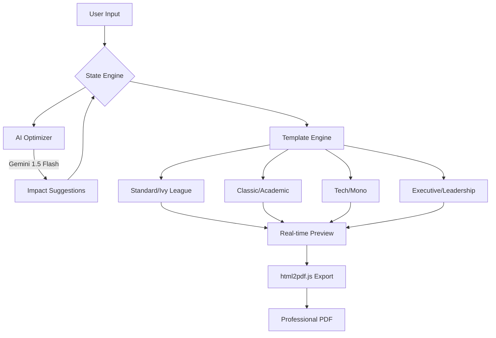

# 📄 CVCraft AI — The Intelligent Resume Blueprint

[](https://reactjs.org/)
[](https://vitejs.dev/)
[](https://www.typescriptlang.org/)
[](https://tailwindcss.com/)
[](https://ai.google.dev/)

> **CVCraft AI** is a premium, enterprise-grade resume engineering platform designed to transform raw career data into high-impact, ATS-optimized professional documents. Built with a "Blueprint" design philosophy, it leverages Google's Gemini AI to apply Ivy League standards to every bullet point.

---

## 🚀 The Problem vs. The Solution

| The Traditional Struggle | The CVCraft AI Blueprint |
| :--- | :--- |
| **Writer's Block:** Staring at a blank page wondering how to describe achievements. | **AI Co-Pilot:** Real-time suggestions using the **Google XYZ Formula** (Accomplished [X] as measured by [Y], by doing [Z]). |
| **Formatting Nightmare:** Spending hours fighting with margins and font sizes in Word. | **Architectural Templates:** Instant switching between Standard, Classic, Tech, and Executive layouts. |
| **ATS Rejection:** Resumes that look good to humans but are invisible to scanners. | **ATS-First Logic:** Structured data entry ensuring every section is perfectly parsable. |

---

## 🧠 Intelligence & Architecture

CVCraft AI operates on a sophisticated pipeline that bridges user intent with professional excellence.

### System Flow Diagram



---

## 🛠️ Tech Stack & Dependencies

### Core Infrastructure
- **Framework:** React 19 (Functional Components, Hooks)
- **Build Tool:** Vite (Ultra-fast HMR)
- **Language:** TypeScript (Strict Type Safety)
- **Styling:** Tailwind CSS (Utility-first design)

### Specialized Modules
- **Intelligence:** `@google/genai` (Gemini 1.5 Flash Integration)
- **Motion:** `framer-motion` (Fluid UI transitions)
- **Icons:** `lucide-react` (Professional SVG iconography)
- **Export:** `html2pdf.js` (Client-side high-fidelity PDF rendering)

---

## 📐 UI Layout Architecture

The application is structured into three primary zones:

1.  **The Control Sidebar:** A vertical navigation system that guides the user through the "Identity -> Education -> Experience -> Skills -> Projects" workflow.
2.  **The Engineering Workspace:** A clean, focused form area where users input their data. Includes "Magic Wand" buttons for AI-powered bullet point rewriting.
3.  **The Live Blueprint:** A real-time, high-fidelity preview of the resume. It uses a 8.5" x 11" container to ensure "What You See Is What You Get" (WYSIWYG).

---

## ⚙️ Setup & Installation

Follow these steps to deploy your own instance of the CVCraft AI Blueprint.

### Prerequisites
- Node.js (v18 or higher)
- A Google Gemini API Key ([Get one here](https://aistudio.google.com/app/apikey))

### 1. Clone & Install
```bash
git clone https://github.com/rahulcvwebsitehosting/cv-craft.git
cd cv-craft
npm install
```

### 2. Environment Configuration
Create a `.env` file in the root directory:
```env
VITE_GEMINI_API_KEY=your_api_key_here
```

### 3. Launch Development Server
```bash
npm run dev
```
The application will be available at `http://localhost:3000`.

---

## 🤝 Connect & Collaborate

Developed with passion by **Rahul Shyam**. I'm always open to discussing sustainable infrastructure, technical presentations, and the future of AI in engineering.

[](https://linkedin.com/in/rahulshyamcivil)
[](https://github.com/rahulcvwebsitehosting)

---

<p align="center">
  <i>"Building the infrastructure of your career, one bullet point at a time."</i><br>
  <b>© 2026 CVCraft AI. All rights reserved.</b>
</p>
